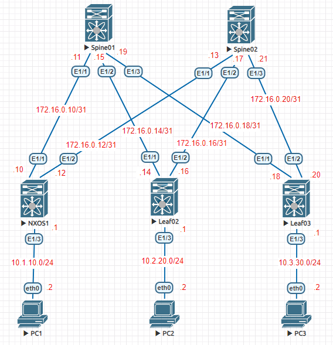
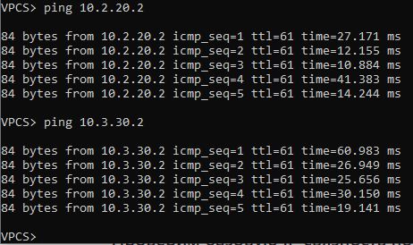
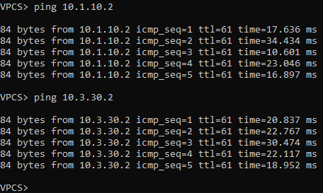
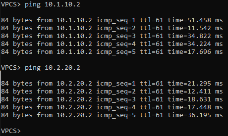

### OSPF на базе Underlay N9k
### Цели
1. Распределить адресное пространство на Underlay сети.
2. Настроить IP связанность между всеми устройствами NXOS.
3. Настроить OSPF для на устройствах NXOS.
3. Настроить аутентификацию на интерфесах между ospf соседями.
4. Проверить соседство и топологию между ocpf соседями.
5. Проверить связность межуд PC1, PC2, PC3.

### Реализовать схему


### Таблица адресов
| Device        | Interface | IP Address   | Mask |
| ------------- |:----------| :------------| :----|
| Spine01       | Ethernet1 | 172.16.0.11  | /31  |
|               | Ethernet2 | 172.16.0.15  | /31  |
|               | Ethernet3 | 172.16.0.19  | /31  |
| Spine02       | Ethernet1 | 172.16.0.13  | /31  |
|               | Ethernet2 | 172.16.0.17  | /31  |
|               | Ethernet3 | 172.16.0.21  | /31  |
| Leaf01        | Ethernet1 | 172.16.0.10  | /31  |
|               | Ethernet2 | 172.16.0.12  | /31  |
|               | Ethernet3 | 10.1.10.1    | /24  |
| Leaf02        | Ethernet1 | 172.16.0.14  | /31  |
|               | Ethernet2 | 172.16.0.16  | /31  |
|               | Ethernet3 | 10.2.20.1    | /24  |
| Leaf03        | Ethernet1 | 172.16.0.18  | /31  |
|               | Ethernet2 | 172.16.0.20  | /31  |
|               | Ethernet3 | 10.3.30.1    | /24  |
| PC1           | Ethernet0 | 10.1.10.2    | /24  |
| PC2           | Ethernet0 | 10.2.20.2    | /24  |
| PC3           | Ethernet0 | 10.3.30.2    | /24  |
| PC4           | Ethernet0 | 10.3.30.3    | /24  |

### Конфигурация устройств
#### Spine01
```
feature ospf
interface Ethernet1/1
  description Leaf01 e1/1
  no switchport
  ip address 172.16.0.11/31
  ip ospf authentication-key 3 4258f34a25410d21
  ip ospf network point-to-point
  no ip ospf passive-interface
  ip router ospf 1 area 0.0.0.0
  no shutdown
interface Ethernet1/2
  description Leaf02 e1/1
  no switchport
  ip address 172.16.0.15/31
  ip ospf authentication-key 3 4258f34a25410d21
  ip ospf network point-to-point
  no ip ospf passive-interface
  ip router ospf 1 area 0.0.0.0
  no shutdown
interface Ethernet1/3
  description Leaf03 e1/1
  no switchport
  ip address 172.16.0.19/31
  ip ospf authentication-key 3 4258f34a25410d21
  ip ospf network point-to-point
  no ip ospf passive-interface
  ip router ospf 1 area 0.0.0.0
  no shutdown
router ospf 1
  router-id 10.10.10.4
  area 0.0.0.0 range 10.10.10.4/32
  area 0.0.0.0 range 172.16.0.10/31
  area 0.0.0.0 range 172.16.0.14/31
  area 0.0.0.0 range 172.16.0.18/31
``` 
#### Spine02
```
feature ospf
interface Ethernet1/1
  description Leaf01 e1/2
  no switchport
  ip address 172.16.0.13/31
  ip ospf authentication-key 3 4258f34a25410d21
  ip ospf network point-to-point
  no ip ospf passive-interface
  ip router ospf 1 area 0.0.0.0
  no shutdown
interface Ethernet1/2
  description Leaf02 e1/2
  no switchport
  ip address 172.16.0.17/31
  ip ospf authentication-key 3 4258f34a25410d21
  ip ospf network point-to-point
  no ip ospf passive-interface
  ip router ospf 1 area 0.0.0.0
  no shutdown
interface Ethernet1/3
  description Leaf03 e1/2
  no switchport
  ip address 172.16.0.21/31
  ip ospf authentication-key 3 4258f34a25410d21
  ip ospf network point-to-point
  no ip ospf passive-interface
  ip router ospf 1 area 0.0.0.0
  no shutdown
router ospf 1
  router-id 10.10.10.5
  area 0.0.0.0 range 10.10.10.5/32
  area 0.0.0.0 range 172.16.0.12/31
  area 0.0.0.0 range 172.16.0.16/31
  area 0.0.0.0 range 172.16.0.20/31
```
#### Leaf01
```
feature ospf
interface Ethernet1/1
  description Spine01 e1/1
  no switchport
  ip address 172.16.0.10/31
  ip ospf authentication-key 3 4258f34a25410d21
  ip ospf network point-to-point
  no ip ospf passive-interface
  ip router ospf 1 area 0.0.0.0
  no shutdown
interface Ethernet1/2
  description Spine02 e1/1
  no switchport
  ip address 172.16.0.12/31
  ip ospf authentication-key 3 4258f34a25410d21
  ip ospf network point-to-point
  no ip ospf passive-interface
  ip router ospf 1 area 0.0.0.0
  no shutdown
interface Ethernet1/3
  no switchport
  ip address 10.1.10.1/24
  ip router ospf 1 area 0.0.0.0
  no shutdown
router ospf 1
  router-id 10.10.10.1
  area 0.0.0.0 range 10.1.10.0/24
  area 0.0.0.0 range 10.10.10.1/32
  area 0.0.0.0 range 172.16.0.10/31
  area 0.0.0.0 range 172.16.0.12/31
```
#### Leaf02
```
feature ospf
interface Ethernet1/1
  description Spine01 e1/2
  no switchport
  ip address 172.16.0.14/31
  ip ospf authentication-key 3 4258f34a25410d21
  ip ospf network point-to-point
  no ip ospf passive-interface
  ip router ospf 1 area 0.0.0.0
  no shutdown
interface Ethernet1/2
  description Spine01 e1/2
  no switchport
  ip address 172.16.0.16/31
  ip ospf authentication-key 3 4258f34a25410d21
  ip ospf network point-to-point
  no ip ospf passive-interface
  ip router ospf 1 area 0.0.0.0
  no shutdown
interface Ethernet1/3
  no switchport
  ip address 10.2.20.1/24
  ip router ospf 1 area 0.0.0.0
  no shutdown
router ospf 1
  router-id 10.10.10.2
  area 0.0.0.0 range 10.2.20.0/24
  area 0.0.0.0 range 10.10.10.2/32
  area 0.0.0.0 range 172.16.0.14/31
  area 0.0.0.0 range 172.16.0.16/31
```
#### Leaf03
```
feature ospf
interface Ethernet1/1
  description Spine01 e1/3
  no switchport
  ip address 172.16.0.18/31
  ip ospf authentication-key 3 4258f34a25410d21
  ip ospf network point-to-point
  no ip ospf passive-interface
  ip router ospf 1 area 0.0.0.0
  no shutdown
interface Ethernet1/2
  description Spine02 e1/3
  no switchport
  ip address 172.16.0.20/31
  ip ospf authentication-key 3 4258f34a25410d21
  ip ospf network point-to-point
  no ip ospf passive-interface
  ip router ospf 1 area 0.0.0.0
  no shutdown
interface Ethernet1/3
  no switchport
  ip address 10.3.30.1/24
  ip router ospf 1 area 0.0.0.0
  no shutdown
router ospf 1
  router-id 10.10.10.3
  area 0.0.0.0 range 10.3.30.0/24
  area 0.0.0.0 range 10.10.10.3/32
  area 0.0.0.0 range 172.16.0.18/31
  area 0.0.0.0 range 172.16.0.20/31

``` 
#### PC1
```
IP/MASK: 10.1.10.2/24  
GATEWAY: 10.1.10.1
```  
#### PC2
```
IP/MASK: 10.2.20.2/24  
GATEWAY: 10.2.20.1
```  
#### PC3
```
IP/MASK: 10.3.30.2/24  
GATEWAY: 10.3.30.1  
```
#### PC4
```
IP/MASK: 10.3.30.3/24  
GATEWAY: 10.3.30.1 
``` 

### Вывод OSPF соседства и топологии между устрйоствами
#### Spine01
```
Spine01# sh ip ospf neighbors
 OSPF Process ID 1 VRF default
 Total number of neighbors: 3
 Neighbor ID     Pri State            Up Time  Address         Interface
 10.10.10.1        1 FULL/ -          00:23:02 172.16.0.10     Eth1/1
 10.10.10.2        1 FULL/ -          00:23:01 172.16.0.14     Eth1/2
 10.10.10.3        1 FULL/ -          00:23:04 172.16.0.18     Eth1/3
```
```
Spine01# sh ip ospf database
        OSPF Router with ID (10.10.10.4) (Process ID 1 VRF default)

                Router Link States (Area 0.0.0.0)

Link ID         ADV Router      Age        Seq#       Checksum Link Count
10.10.10.1      10.10.10.1      1387       0x8000000d 0xa534   4
10.10.10.2      10.10.10.2      1385       0x8000000d 0x7750   4
10.10.10.3      10.10.10.3      1391       0x8000000b 0x4d6a   4
10.10.10.4      10.10.10.4      1387       0x8000000d 0x5155   6
10.10.10.5      10.10.10.5      1386       0x80000011 0x3361   6
```
#### Spine02
```
Spine02# sh ip ospf neighbors
 OSPF Process ID 1 VRF default
 Total number of neighbors: 3
 Neighbor ID     Pri State            Up Time  Address         Interface
 10.10.10.1        1 FULL/ -          00:20:24 172.16.0.12     Eth1/1
 10.10.10.2        1 FULL/ -          00:20:24 172.16.0.16     Eth1/2
 10.10.10.3        1 FULL/ -          00:20:29 172.16.0.20     Eth1/3
```
```
Spine02# sh ip ospf database
        OSPF Router with ID (10.10.10.5) (Process ID 1 VRF default)

                Router Link States (Area 0.0.0.0)

Link ID         ADV Router      Age        Seq#       Checksum Link Count
10.10.10.1      10.10.10.1      1234       0x8000000d 0xa534   4
10.10.10.2      10.10.10.2      1236       0x8000000d 0x7750   4
10.10.10.3      10.10.10.3      1239       0x8000000b 0x4d6a   4
10.10.10.4      10.10.10.4      1237       0x8000000d 0x5155   6
10.10.10.5      10.10.10.5      1233       0x80000011 0x3361   6
```
#### Leaf01
```
Leaf01# sh ip ospf neighbors
 OSPF Process ID 1 VRF default
 Total number of neighbors: 2
 Neighbor ID     Pri State            Up Time  Address         Interface
 10.10.10.4        1 FULL/ -          00:25:20 172.16.0.11     Eth1/1
 10.10.10.5        1 FULL/ -          00:25:17 172.16.0.13     Eth1/2
```
```
Leaf01# sh ip ospf database
        OSPF Router with ID (10.10.10.1) (Process ID 1 VRF default)

                Router Link States (Area 0.0.0.0)

Link ID         ADV Router      Age        Seq#       Checksum Link Count
10.10.10.1      10.10.10.1      1522       0x8000000d 0xa534   4
10.10.10.2      10.10.10.2      1524       0x8000000d 0x7750   4
10.10.10.3      10.10.10.3      1530       0x8000000b 0x4d6a   4
10.10.10.4      10.10.10.4      1525       0x8000000d 0x5155   6
10.10.10.5      10.10.10.5      1525       0x80000011 0x3361   6
```
#### Leaf02
```
Leaf02# sh ip ospf neighbors
 OSPF Process ID 1 VRF default
 Total number of neighbors: 2
 Neighbor ID     Pri State            Up Time  Address         Interface
 10.10.10.4        1 FULL/ -          00:26:05 172.16.0.15     Eth1/1
 10.10.10.5        1 FULL/ -          00:26:03 172.16.0.17     Eth1/2
```
```
Leaf02# sh ip ospf database
        OSPF Router with ID (10.10.10.2) (Process ID 1 VRF default)

                Router Link States (Area 0.0.0.0)

Link ID         ADV Router      Age        Seq#       Checksum Link Count
10.10.10.1      10.10.10.1      1570       0x8000000d 0xa534   4
10.10.10.2      10.10.10.2      1568       0x8000000d 0x7750   4
10.10.10.3      10.10.10.3      1574       0x8000000b 0x4d6a   4
10.10.10.4      10.10.10.4      1572       0x8000000d 0x5155   6
10.10.10.5      10.10.10.5      1571       0x80000011 0x3361   6
```
#### Leaf03
```
Leaf03# sh ip ospf neighbors
 OSPF Process ID 1 VRF default
 Total number of neighbors: 2
 Neighbor ID     Pri State            Up Time  Address         Interface
 10.10.10.4        1 FULL/ -          00:26:52 172.16.0.19     Eth1/1
 10.10.10.5        1 FULL/ -          00:26:52 172.16.0.21     Eth1/2
```
```
Leaf03# sh ip ospf database
        OSPF Router with ID (10.10.10.3) (Process ID 1 VRF default)

                Router Link States (Area 0.0.0.0)

Link ID         ADV Router      Age        Seq#       Checksum Link Count
10.10.10.1      10.10.10.1      1623       0x8000000d 0xa534   4
10.10.10.2      10.10.10.2      1624       0x8000000d 0x7750   4
10.10.10.3      10.10.10.3      1627       0x8000000b 0x4d6a   4
10.10.10.4      10.10.10.4      1625       0x8000000d 0x5155   6
10.10.10.5      10.10.10.5      1623       0x80000011 0x3361   6
```
### Вывод связности между устройствами PC1, PC2, PC3
#### PC1
```

```
```

```
```

```
