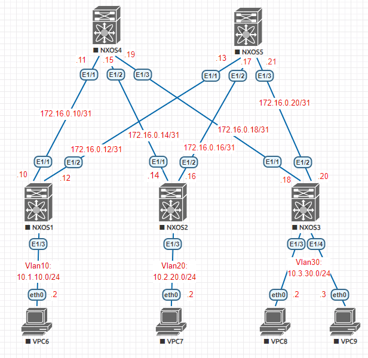

### OSPF на базе Underlay N9k
### Цели
1. Настроить OSPF для Underlay сети и IP связанность между всеми устройствами NXOS.
2. Распределить адресное пространство на Underlay сети.

### Реализовать схему


### Таблица адресов
| Device        | Interface | IP Address   | Mask |
| ------------- |:----------| :------------| :----|
| Spine01       | Ethernet1 | 172.16.0.11  | /31  |
|               | Ethernet2 | 172.16.0.15  | /31  |
|               | Ethernet3 | 172.16.0.19  | /31  |
| Spine02       | Ethernet1 | 172.16.0.13  | /31  |
|               | Ethernet2 | 172.16.0.17  | /31  |
|               | Ethernet3 | 172.16.0.21  | /31  |
| Leaf01        | Ethernet1 | 172.16.0.10  | /31  |
|               | Ethernet2 | 172.16.0.12  | /31  |
|               | vlan10    | 10.1.10.1    | /24  |
| Leaf02        | Ethernet1 | 172.16.0.14  | /31  |
|               | Ethernet2 | 172.16.0.16  | /31  |
|               | vlan20    | 10.2.20.1    | /24  |
| Leaf03        | Ethernet1 | 172.16.0.18  | /31  |
|               | Ethernet2 | 172.16.0.20  | /31  |
|               | vlan30    | 10.3.30.1    | /24  |
| PC1           | Ethernet0 | 10.1.10.2    | /24  |
| PC2           | Ethernet0 | 10.2.20.2    | /24  |
| PC3           | Ethernet0 | 10.3.30.2    | /24  |
| PC4           | Ethernet0 | 10.3.30.3    | /24  |

### Конфигурация устройств
#### Spine01
```
feature ospf
interface Ethernet1/1
  description Leaf01 e1/1
  no switchport
  ip address 172.16.0.11/31
  ip ospf authentication-key 3 4258f34a25410d21
  ip ospf network point-to-point
  no ip ospf passive-interface
  ip router ospf 1 area 0.0.0.0
  no shutdown
interface Ethernet1/2
  description Leaf02 e1/1
  no switchport
  ip address 172.16.0.15/31
  ip ospf authentication-key 3 4258f34a25410d21
  ip ospf network point-to-point
  no ip ospf passive-interface
  ip router ospf 1 area 0.0.0.0
  no shutdown
interface Ethernet1/3
  description Leaf03 e1/1
  no switchport
  ip address 172.16.0.19/31
  ip ospf authentication-key 3 4258f34a25410d21
  ip ospf network point-to-point
  no ip ospf passive-interface
  ip router ospf 1 area 0.0.0.0
  no shutdown
router ospf 1
  router-id 10.10.10.4
  area 0.0.0.0 range 10.10.10.4/32
  area 0.0.0.0 range 172.16.0.10/31
  area 0.0.0.0 range 172.16.0.14/31
  area 0.0.0.0 range 172.16.0.18/31
``` 
#### Spine02
```
feature ospf
interface Ethernet1/1
  description Leaf01 e1/2
  no switchport
  ip address 172.16.0.13/31
  ip ospf authentication-key 3 4258f34a25410d21
  ip ospf network point-to-point
  no ip ospf passive-interface
  ip router ospf 1 area 0.0.0.0
  no shutdown
interface Ethernet1/2
  description Leaf02 e1/2
  no switchport
  ip address 172.16.0.17/31
  ip ospf authentication-key 3 4258f34a25410d21
  ip ospf network point-to-point
  no ip ospf passive-interface
  ip router ospf 1 area 0.0.0.0
  no shutdown
interface Ethernet1/3
  description Leaf03 e1/2
  no switchport
  ip address 172.16.0.21/31
  ip ospf authentication-key 3 4258f34a25410d21
  ip ospf network point-to-point
  no ip ospf passive-interface
  ip router ospf 1 area 0.0.0.0
  no shutdown
router ospf 1
  router-id 10.10.10.5
  area 0.0.0.0 range 10.10.10.5/32
  area 0.0.0.0 range 172.16.0.12/31
  area 0.0.0.0 range 172.16.0.16/31
  area 0.0.0.0 range 172.16.0.20/31
```
#### Leaf01
```
feature ospf
interface Ethernet1/1
  description Spine01 e1/1
  no switchport
  ip address 172.16.0.10/31
  ip ospf authentication-key 3 4258f34a25410d21
  ip ospf network point-to-point
  no ip ospf passive-interface
  ip router ospf 1 area 0.0.0.0
  no shutdown
interface Ethernet1/2
  description Spine02 e1/1
  no switchport
  ip address 172.16.0.12/31
  ip ospf authentication-key 3 4258f34a25410d21
  ip ospf network point-to-point
  no ip ospf passive-interface
  ip router ospf 1 area 0.0.0.0
  no shutdown
router ospf 1
  router-id 10.10.10.1
  area 0.0.0.0 range 10.1.10.0/24
  area 0.0.0.0 range 10.10.10.1/32
  area 0.0.0.0 range 172.16.0.10/31
  area 0.0.0.0 range 172.16.0.12/31
```
#### Leaf02
```
feature ospf
interface Ethernet1/1
  description Spine01 e1/2
  no switchport
  ip address 172.16.0.14/31
  ip ospf authentication-key 3 4258f34a25410d21
  ip ospf network point-to-point
  no ip ospf passive-interface
  ip router ospf 1 area 0.0.0.0
  no shutdown
interface Ethernet1/2
  description Spine01 e1/2
  no switchport
  ip address 172.16.0.16/31
  ip ospf authentication-key 3 4258f34a25410d21
  ip ospf network point-to-point
  no ip ospf passive-interface
  ip router ospf 1 area 0.0.0.0
  no shutdown
router ospf 1
  router-id 10.10.10.2
  area 0.0.0.0 range 10.2.20.0/24
  area 0.0.0.0 range 10.10.10.2/32
  area 0.0.0.0 range 172.16.0.14/31
  area 0.0.0.0 range 172.16.0.16/31
```
#### Leaf03
```
feature ospf
interface Ethernet1/1
  description Spine01 e1/3
  no switchport
  ip address 172.16.0.18/31
  ip ospf authentication-key 3 4258f34a25410d21
  ip ospf network point-to-point
  no ip ospf passive-interface
  ip router ospf 1 area 0.0.0.0
  no shutdown
interface Ethernet1/2
  description Spine02 e1/3
  no switchport
  ip address 172.16.0.20/31
  ip ospf authentication-key 3 4258f34a25410d21
  ip ospf network point-to-point
  no ip ospf passive-interface
  ip router ospf 1 area 0.0.0.0
  no shutdown
router ospf 1
  router-id 10.10.10.3
  area 0.0.0.0 range 10.3.30.0/24
  area 0.0.0.0 range 10.10.10.3/32
  area 0.0.0.0 range 172.16.0.18/31
  area 0.0.0.0 range 172.16.0.20/31

``` 
#### PC1
```
IP/MASK: 10.1.10.2/24  
GATEWAY: 10.1.10.1
```  
#### PC2
```
IP/MASK: 10.2.20.2/24  
GATEWAY: 10.2.20.1
```  
#### PC3
```
IP/MASK: 10.3.30.2/24  
GATEWAY: 10.3.30.1  
```
#### PC4
```
IP/MASK: 10.3.30.3/24  
GATEWAY: 10.3.30.1 
``` 