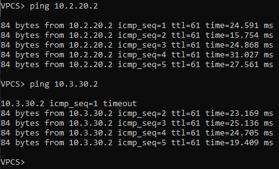

### IS-IS на базе Underlay N9k
### Цели
1. Распределить адресное пространство на Underlay сети.
2. Настроить IP связанность между всеми устройствами NXOS.
3. Настроить IS-IS для на устройствах NXOS.
3. Настроить аутентификацию на интерфесах между is-is соседями.
4. Проверить соседство и топологию между is-is соседями.
5. Проверить связность между PC1, PC2, PC3.
### Реализовать схему


### Таблица адресов
| Device        | Interface | IP Address   | Mask |
| ------------- |:----------| :------------| :----|
| Spine01       | Ethernet1 | 172.16.0.11  | /31  |
|               | Ethernet2 | 172.16.0.15  | /31  |
|               | Ethernet3 | 172.16.0.19  | /31  |
| Spine02       | Ethernet1 | 172.16.0.13  | /31  |
|               | Ethernet2 | 172.16.0.17  | /31  |
|               | Ethernet3 | 172.16.0.21  | /31  |
| Leaf01        | Ethernet1 | 172.16.0.10  | /31  |
|               | Ethernet2 | 172.16.0.12  | /31  |
|               | Ethernet3 | 10.1.10.1    | /24  |
| Leaf02        | Ethernet1 | 172.16.0.14  | /31  |
|               | Ethernet2 | 172.16.0.16  | /31  |
|               | Ethernet3 | 10.2.20.1    | /24  |
| Leaf03        | Ethernet1 | 172.16.0.18  | /31  |
|               | Ethernet2 | 172.16.0.20  | /31  |
|               | Ethernet3 | 10.3.30.1    | /24  |
| PC1           | Ethernet0 | 10.1.10.2    | /24  |
| PC2           | Ethernet0 | 10.2.20.2    | /24  |
| PC3           | Ethernet0 | 10.3.30.2    | /24  |
| PC4           | Ethernet0 | 10.3.30.3    | /24  |

### Конфигурация устройств
#### Spine01
```
feature isis
interface Ethernet1/1
  description Leaf01 e1/1
  no switchport
  ip address 172.16.0.11/31
  no isis hello-padding always
  isis network point-to-point
  isis authentication key-chain otus
  ip router isis 1
  no shutdown
interface Ethernet1/2
  description Leaf02 e1/1
  no switchport
  ip address 172.16.0.15/31
  no isis hello-padding always
  isis network point-to-point
  isis authentication key-chain otus
  ip router isis 1
  no shutdown
interface Ethernet1/3
  description Leaf03 e1/1
  no switchport
  ip address 172.16.0.19/31
  no isis hello-padding always
  isis network point-to-point
  isis authentication key-chain otus
  ip router isis 1
  no shutdown
router isis 1
  net 49.0001.0100.0000.0004.00
  is-type level-1
  log-adjacency-changes
``` 
#### Spine02
```
feature isis
interface Ethernet1/1
  description Leaf01 e1/2
  no switchport
  ip address 172.16.0.13/31
  no isis hello-padding always
  isis network point-to-point
  isis authentication key-chain otus
  ip router isis 1
  no shutdown
interface Ethernet1/2
  description Leaf02 e1/2
  no switchport
  ip address 172.16.0.17/31
  no isis hello-padding always
  isis network point-to-point
  isis authentication key-chain otus
  ip router isis 1
  no shutdown
interface Ethernet1/3
  description Leaf03 e1/2
  no switchport
  ip address 172.16.0.21/31
  no isis hello-padding always
  isis network point-to-point
  isis authentication key-chain otus
  ip router isis 1
  no shutdown
router isis 1
  net 49.0001.0100.0000.0005.00
  is-type level-1
  log-adjacency-changes
```
#### Leaf01
```
feature ospf
interface Ethernet1/1
  description Spine01 e1/1
  no switchport
  ip address 172.16.0.10/31
  no isis hello-padding always
  isis network point-to-point
  isis authentication key-chain otus
  ip router isis 1
  no shutdown
interface Ethernet1/2
  description Spine02 e1/1
  no switchport
  ip address 172.16.0.12/31
  no isis hello-padding always
  isis network point-to-point
  isis authentication key-chain otus
  ip router isis 1
  no shutdown
interface Ethernet1/3
  no switchport
  ip address 10.1.10.1/24
  ip router isis 1
  no shutdown
router isis 1
  net 49.0001.0100.0000.0001.00
  is-type level-1
  log-adjacency-changes
```
#### Leaf02
```
feature ospf
interface Ethernet1/1
  description Spine01 e1/2
  no switchport
  ip address 172.16.0.14/31
  no isis hello-padding always
  isis network point-to-point
  isis authentication key-chain otus
  ip router isis 1
  no shutdown
interface Ethernet1/2
  description Spine01 e1/2
  no switchport
  ip address 172.16.0.16/31
  no isis hello-padding always
  isis network point-to-point
  isis authentication key-chain otus
  ip router isis 1
  no shutdown
interface Ethernet1/3
  no switchport
  ip address 10.2.20.1/24
  ip router isis 1
  no shutdown
router isis 1
  net 49.0001.0100.0000.0002.00
  is-type level-1
  log-adjacency-changes
```
#### Leaf03
```
feature ospf
interface Ethernet1/1
  description Spine01 e1/3
  no switchport
  ip address 172.16.0.18/31
  no isis hello-padding always
  isis network point-to-point
  isis authentication key-chain otus
  ip router isis 1
  no shutdown
interface Ethernet1/2
  description Spine02 e1/3
  no switchport
  ip address 172.16.0.20/31
  no isis hello-padding always
  isis network point-to-point
  isis authentication key-chain otus
  ip router isis 1
  no shutdown
interface Ethernet1/3
  no switchport
  ip address 10.3.30.1/24
  ip router isis 1
  no shutdown
router isis 1
  net 49.0001.0100.0000.0003.00
  is-type level-1
  log-adjacency-changes

``` 
#### PC1
```
IP/MASK: 10.1.10.2/24  
GATEWAY: 10.1.10.1
```  
#### PC2
```
IP/MASK: 10.2.20.2/24  
GATEWAY: 10.2.20.1
```  
#### PC3
```
IP/MASK: 10.3.30.2/24  
GATEWAY: 10.3.30.1  
```
#### PC4
```
IP/MASK: 10.3.30.3/24  
GATEWAY: 10.3.30.1 
``` 

### Вывод IS-IS соседства и топологии между устрйоствами
#### Spine01
```
Spine01# sh isis 1 adjacency
IS-IS process: 1 VRF: default
IS-IS adjacency database:
Legend: '!': No AF level connectivity in given topology
System ID       SNPA            Level  State  Hold Time  Interface
Leaf01          N/A             1      UP     00:00:27   Ethernet1/1
Leaf02          N/A             1      UP     00:00:29   Ethernet1/2
Leaf03          N/A             1      UP     00:00:28   Ethernet1/3
```
```
Spine01# sh isis 1 database
IS-IS Process: 1 LSP database VRF: default
IS-IS Level-1 Link State Database
  LSPID                 Seq Number   Checksum  Lifetime   A/P/O/T
  Leaf01.00-00          0x00000013   0xBFC4    941        0/0/0/1
  Leaf02.00-00          0x00000013   0x57F1    976        0/0/0/1
  Leaf03.00-00          0x00000012   0xF01E    1038       0/0/0/1
  Spine01.00-00       * 0x00000014   0xA01E    811        0/0/0/1
  Spine02.00-00         0x0000000E   0xBEED    1020       0/0/0/1
```
#### Spine02
```
Spine02# sh isis 1 adjacency
IS-IS process: 1 VRF: default
IS-IS adjacency database:
Legend: '!': No AF level connectivity in given topology
System ID       SNPA            Level  State  Hold Time  Interface
Leaf01          N/A             1      UP     00:00:33   Ethernet1/1
Leaf02          N/A             1      UP     00:00:25   Ethernet1/2
Leaf03          N/A             1      UP     00:00:24   Ethernet1/3
```
```
Spine02# sh isis 1 database
IS-IS Process: 1 LSP database VRF: default
IS-IS Level-1 Link State Database
  LSPID                 Seq Number   Checksum  Lifetime   A/P/O/T
  Leaf01.00-00          0x00000013   0xBFC4    897        0/0/0/1
  Leaf02.00-00          0x00000013   0x57F1    931        0/0/0/1
  Leaf03.00-00          0x00000012   0xF01E    994        0/0/0/1
  Spine01.00-00         0x00000014   0xA01E    764        0/0/0/1
  Spine02.00-00       * 0x0000000E   0xBEED    977        0/0/0/1
```
#### Leaf01
```
Leaf01# sh isis 1 adjacency
IS-IS process: 1 VRF: default
IS-IS adjacency database:
Legend: '!': No AF level connectivity in given topology
System ID       SNPA            Level  State  Hold Time  Interface
Spine01         N/A             1      UP     00:00:21   Ethernet1/1
Spine02         N/A             1      UP     00:00:27   Ethernet1/2
```
```
sh isis 1 database
IS-IS Process: 1 LSP database VRF: default
IS-IS Level-1 Link State Database
  LSPID                 Seq Number   Checksum  Lifetime   A/P/O/T
  Leaf01.00-00        * 0x00000013   0xBFC4    855        0/0/0/1
  Leaf02.00-00          0x00000013   0x57F1    887        0/0/0/1
  Leaf03.00-00          0x00000012   0xF01E    950        0/0/0/1
  Spine01.00-00         0x00000014   0xA01E    722        0/0/0/1
  Spine02.00-00         0x0000000E   0xBEED    933        0/0/0/1
```
#### Leaf02
```
Leaf02# sh isis 1 adjacency
IS-IS process: 1 VRF: default
IS-IS adjacency database:
Legend: '!': No AF level connectivity in given topology
System ID       SNPA            Level  State  Hold Time  Interface
Spine01         N/A             1      UP     00:00:23   Ethernet1/1
Spine02         N/A             1      UP     00:00:32   Ethernet1/2
```
```
Leaf02# sh isis 1 database
IS-IS Process: 1 LSP database VRF: default
IS-IS Level-1 Link State Database
  LSPID                 Seq Number   Checksum  Lifetime   A/P/O/T
  Leaf01.00-00          0x00000013   0xBFC4    806        0/0/0/1
  Leaf02.00-00        * 0x00000013   0x57F1    842        0/0/0/1
  Leaf03.00-00          0x00000012   0xF01E    903        0/0/0/1
  Spine01.00-00         0x00000014   0xA01E    676        0/0/0/1
  Spine02.00-00         0x0000000E   0xBEED    887        0/0/0/1
```
#### Leaf03
```
Leaf03# sh isis 1 adjacency
IS-IS process: 1 VRF: default
IS-IS adjacency database:
Legend: '!': No AF level connectivity in given topology
System ID       SNPA            Level  State  Hold Time  Interface
Spine01         N/A             1      UP     00:00:28   Ethernet1/1
Spine02         N/A             1      UP     00:00:30   Ethernet1/2
```
```
Leaf03# sh isis 1 database
IS-IS Process: 1 LSP database VRF: default
IS-IS Level-1 Link State Database
  LSPID                 Seq Number   Checksum  Lifetime   A/P/O/T
  Leaf01.00-00          0x00000013   0xBFC4    773        0/0/0/1
  Leaf02.00-00          0x00000013   0x57F1    807        0/0/0/1
  Leaf03.00-00        * 0x00000012   0xF01E    872        0/0/0/1
  Spine01.00-00         0x00000014   0xA01E    642        0/0/0/1
  Spine02.00-00         0x0000000E   0xBEED    853        0/0/0/1
```
### Вывод связности между устройствами PC1, PC2, PC3
#### PC1


#### PC2


#### PC3
