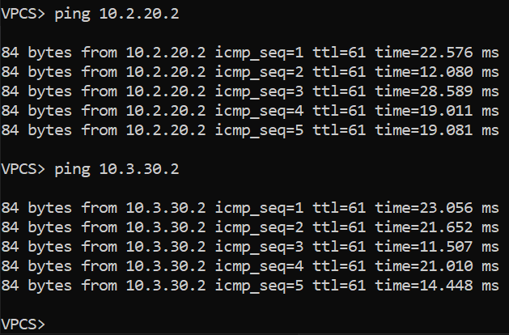
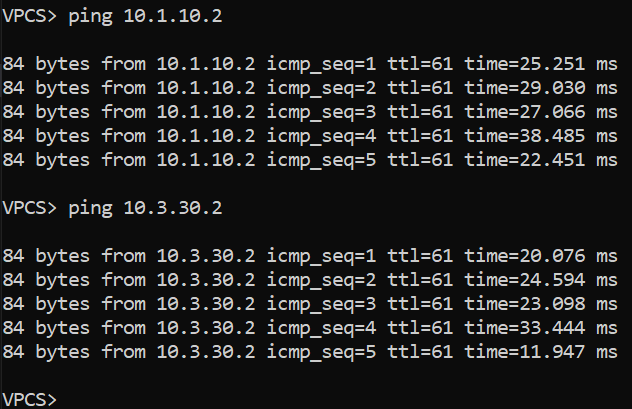
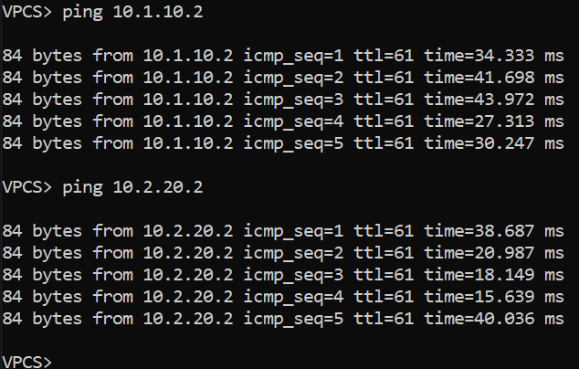

### BGP на базе Underlay N9k
### Цели
1. Распределить адресное пространство на Underlay сети.
2. Настроить IP связанность между всеми устройствами NXOS.
3. Настроить BGP для на устройствах NXOS.
3. Настроить аутентификацию на интерфесах между BGP соседями.
4. Проверить соседство и топологию между BGP соседями.
5. Проверить связность между PC1, PC2, PC3.
### Реализовать схему


### Таблица адресов
| Device        | Interface | IP Address   | Mask |
| ------------- |:----------| :------------| :----|
| Spine01       | Ethernet1 | 172.16.0.11  | /31  |
|               | Ethernet2 | 172.16.0.15  | /31  |
|               | Ethernet3 | 172.16.0.19  | /31  |
| Spine02       | Ethernet1 | 172.16.0.13  | /31  |
|               | Ethernet2 | 172.16.0.17  | /31  |
|               | Ethernet3 | 172.16.0.21  | /31  |
| Leaf01        | Ethernet1 | 172.16.0.10  | /31  |
|               | Ethernet2 | 172.16.0.12  | /31  |
|               | Ethernet3 | 10.1.10.1    | /24  |
| Leaf02        | Ethernet1 | 172.16.0.14  | /31  |
|               | Ethernet2 | 172.16.0.16  | /31  |
|               | Ethernet3 | 10.2.20.1    | /24  |
| Leaf03        | Ethernet1 | 172.16.0.18  | /31  |
|               | Ethernet2 | 172.16.0.20  | /31  |
|               | Ethernet3 | 10.3.30.1    | /24  |
| PC1           | Ethernet0 | 10.1.10.2    | /24  |
| PC2           | Ethernet0 | 10.2.20.2    | /24  |
| PC3           | Ethernet0 | 10.3.30.2    | /24  |
| PC4           | Ethernet0 | 10.3.30.3    | /24  |

### Конфигурация устройств
#### Spine01
```
feature bgp
interface Ethernet1/1
  description Leaf01 e1/1
  no switchport
  ip address 172.16.0.11/31
  no shutdown
interface Ethernet1/2
  description Leaf02 e1/1
  no switchport
  ip address 172.16.0.15/31
  no shutdown
interface Ethernet1/3
  description Leaf03 e1/1
  no switchport
  ip address 172.16.0.19/31
  no shutdown
interface loopback0
  ip address 10.10.10.4/32
router bgp 65004
  router-id 10.10.10.4
  bestpath as-path multipath-relax
  log-neighbor-changes
  address-family ipv4 unicast
    network 10.10.10.4/32
    maximum-paths 64
  template peer Leafs
    password 3 4258f34a25410d21
    address-family ipv4 unicast
      default-originate
  neighbor 172.16.0.10
    inherit peer Leafs
    remote-as 65001
    description Leaf01
    address-family ipv4 unicast
  neighbor 172.16.0.14
    inherit peer Leafs
    remote-as 65002
    description Leaf02
    address-family ipv4 unicast
  neighbor 172.16.0.18
    inherit peer Leafs
    remote-as 65003
    description Leaf03
    address-family ipv4 unicast
``` 
#### Spine02
```
feature bgp
interface Ethernet1/1
  description Leaf01 e1/2
  no switchport
  ip address 172.16.0.13/31
  no shutdown
interface Ethernet1/2
  description Leaf02 e1/2
  no switchport
  ip address 172.16.0.17/31
  no shutdown
interface Ethernet1/3
  description Leaf03 e1/2
  no switchport
  ip address 172.16.0.21/31
  no shutdown
 interface loopback0
  ip address 10.10.10.5/32 
router bgp 65005
  router-id 10.10.10.5
  bestpath as-path multipath-relax
  log-neighbor-changes
  address-family ipv4 unicast
    network 10.10.10.5/32
    maximum-paths 64
  template peer Leafs
    password 3 4258f34a25410d21
    address-family ipv4 unicast
      default-originate
  neighbor 172.16.0.12
    inherit peer Leafs
    remote-as 65001
    description Leaf01
    address-family ipv4 unicast
  neighbor 172.16.0.16
    inherit peer Leafs
    remote-as 65002
    description Leaf02
    address-family ipv4 unicast
  neighbor 172.16.0.20
    inherit peer Leafs
    remote-as 65003
    description Leaf03
    address-family ipv4 unicast
```
#### Leaf01
```
feature bgp
interface Ethernet1/1
  description Spine01 e1/1
  no switchport
  ip address 172.16.0.10/31
  no shutdown
interface Ethernet1/2
  description Spine02 e1/1
  no switchport
  ip address 172.16.0.12/31
  no shutdown
interface Ethernet1/3
  no switchport
  ip address 10.1.10.1/24
  no shutdown
interface loopback0
  ip address 10.10.10.1/32
router bgp 65001
  router-id 10.10.10.1
  bestpath as-path multipath-relax
  log-neighbor-changes
  address-family ipv4 unicast
    network 10.1.10.0/24
    network 10.10.10.1/32
    maximum-paths 64
  template peer Spines
    password 3 4258f34a25410d21
    address-family ipv4 unicast
  neighbor 172.16.0.11
    inherit peer Spines
    remote-as 65004
    description Spine01
  neighbor 172.16.0.13
    inherit peer Spines
    remote-as 65005
    description Spine02
```
#### Leaf02
```
feature bgp
interface Ethernet1/1
  description Spine01 e1/2
  no switchport
  ip address 172.16.0.14/31
  no shutdown
interface Ethernet1/2
  description Spine01 e1/2
  no switchport
  ip address 172.16.0.16/31
  no shutdown
interface Ethernet1/3
  no switchport
  ip address 10.2.20.1/24
  no shutdown
interface loopback0
  ip address 10.10.10.2/32
router bgp 65002
  router-id 10.10.10.2
  bestpath as-path multipath-relax
  log-neighbor-changes
  address-family ipv4 unicast
    network 10.2.20.0/24
    network 10.10.10.2/32
    maximum-paths 64
  template peer Spines
    password 3 4258f34a25410d21
    address-family ipv4 unicast
  neighbor 172.16.0.15
    inherit peer Spines
    remote-as 65004
    description Spine01
  neighbor 172.16.0.17
    inherit peer Spines
    remote-as 65005
    description Spine02
```
#### Leaf03
```
feature bgp
interface Ethernet1/1
  description Spine01 e1/3
  no switchport
  ip address 172.16.0.18/31
  no shutdown
interface Ethernet1/2
  description Spine02 e1/3
  no switchport
  ip address 172.16.0.20/31
  no shutdown
interface Ethernet1/3
  no switchport
  ip address 10.3.30.1/24
  no shutdown
interface loopback0
  ip address 10.10.10.3/32
router bgp 65003
  router-id 10.10.10.3
  bestpath as-path multipath-relax
  log-neighbor-changes
  address-family ipv4 unicast
    network 10.3.30.0/24
    network 10.10.10.3/32
    maximum-paths 64
  template peer Spines
    password 3 4258f34a25410d21
    address-family ipv4 unicast
  neighbor 172.16.0.19
    inherit peer Spines
    remote-as 65004
    description Spine01
  neighbor 172.16.0.21
    inherit peer Spines
    remote-as 65005
    description Spine02
``` 
#### PC1
```
IP/MASK: 10.1.10.2/24  
GATEWAY: 10.1.10.1
```  
#### PC2
```
IP/MASK: 10.2.20.2/24  
GATEWAY: 10.2.20.1
```  
#### PC3
```
IP/MASK: 10.3.30.2/24  
GATEWAY: 10.3.30.1  
```
#### PC4
```
IP/MASK: 10.3.30.3/24  
GATEWAY: 10.3.30.1 
``` 

### Вывод BGP соседства и топологии между устрйоствами
#### Spine01
```
Spine01# sh ip bgp summary
Neighbor        V    AS MsgRcvd MsgSent   TblVer  InQ OutQ Up/Down  State/PfxRcd
172.16.0.10     4 65001     113      92       51    0    0 00:01:30 3
172.16.0.14     4 65002     105      92       51    0    0 00:01:16 3
172.16.0.18     4 65003     105      93       51    0    0 00:00:59 3
```
```
Spine01# sh ip bgp
   Network            Next Hop            Metric     LocPrf     Weight Path
*>e0.0.0.0/0          172.16.0.10                                    0 65001 65005 i
*|e                   172.16.0.18                                    0 65003 65005 i
*>e10.1.10.0/24       172.16.0.10                                    0 65001 i
* e                   172.16.0.18                                    0 65003 65005 65001 i
* e10.2.20.0/24       172.16.0.10                                    0 65001 65005 65002 i
* e                   172.16.0.18                                    0 65003 65005 65002 i
*>e                   172.16.0.14                                    0 65002 i
* e10.3.30.0/24       172.16.0.10                                    0 65001 65005 65003 i
*>e                   172.16.0.18                                    0 65003 i
* e                   172.16.0.14                                    0 65002 65005 65003 i
*>e10.10.10.1/32      172.16.0.10                                    0 65001 i
* e                   172.16.0.18                                    0 65003 65005 65001 i
* e10.10.10.2/32      172.16.0.10                                    0 65001 65005 65002 i
* e                   172.16.0.18                                    0 65003 65005 65002 i
*>e                   172.16.0.14                                    0 65002 i
* e10.10.10.3/32      172.16.0.10                                    0 65001 65005 65003 i
*>e                   172.16.0.18                                    0 65003 i
* e                   172.16.0.14                                    0 65002 65005 65003 i
*>l10.10.10.4/32      0.0.0.0                           100      32768 i
*>e10.10.10.5/32      172.16.0.10                                    0 65001 65005 i
*|e                   172.16.0.18                                    0 65003 65005 i
*|e                   172.16.0.14                                    0 65002 65005 i
```
```
Spine01# sh ip route bgp
0.0.0.0/0, ubest/mbest: 2/0
    *via 172.16.0.10, [20/0], 00:05:38, bgp-65004, external, tag 65001
    *via 172.16.0.18, [20/0], 00:05:36, bgp-65004, external, tag 65003
10.1.10.0/24, ubest/mbest: 1/0
    *via 172.16.0.10, [20/0], 00:05:38, bgp-65004, external, tag 65001
10.2.20.0/24, ubest/mbest: 1/0
    *via 172.16.0.14, [20/0], 00:05:35, bgp-65004, external, tag 65002
10.3.30.0/24, ubest/mbest: 1/0
    *via 172.16.0.18, [20/0], 00:05:36, bgp-65004, external, tag 65003
10.10.10.1/32, ubest/mbest: 1/0
    *via 172.16.0.10, [20/0], 00:05:38, bgp-65004, external, tag 65001
10.10.10.2/32, ubest/mbest: 1/0
    *via 172.16.0.14, [20/0], 00:05:35, bgp-65004, external, tag 65002
10.10.10.3/32, ubest/mbest: 1/0
    *via 172.16.0.18, [20/0], 00:05:36, bgp-65004, external, tag 65003
10.10.10.5/32, ubest/mbest: 3/0
    *via 172.16.0.10, [20/0], 00:05:38, bgp-65004, external, tag 65001
    *via 172.16.0.14, [20/0], 00:05:35, bgp-65004, external, tag 65002
    *via 172.16.0.18, [20/0], 00:05:36, bgp-65004, external, tag 65003
```
#### Spine02
```
Spine02# sh ip bgp summary
Neighbor        V    AS MsgRcvd MsgSent   TblVer  InQ OutQ Up/Down  State/PfxRcd
172.16.0.12     4 65001     140     109      229    0    0 00:06:43 8
172.16.0.16     4 65002     133     110      229    0    0 00:06:30 8
172.16.0.20     4 65003     134     112      229    0    0 00:06:13 8
```
```
Spine02# sh ip bgp
   Network            Next Hop            Metric     LocPrf     Weight Path
*>e0.0.0.0/0          172.16.0.16                                    0 65002 65004 i
*>e10.1.10.0/24       172.16.0.12                                    0 65001 i
* e                   172.16.0.16                                    0 65002 65004 65001 i
*>e10.2.20.0/24       172.16.0.16                                    0 65002 i
*>e10.3.30.0/24       172.16.0.20                                    0 65003 i
*>e10.10.10.1/32      172.16.0.12                                    0 65001 i
* e                   172.16.0.16                                    0 65002 65004 65001 i
*>e10.10.10.2/32      172.16.0.16                                    0 65002 i
*>e10.10.10.3/32      172.16.0.20                                    0 65003 i
*>e10.10.10.4/32      172.16.0.12                                    0 65001 65004 i
*|e                   172.16.0.16                                    0 65002 65004 i
*|e                   172.16.0.20                                    0 65003 65004 i
*>l10.10.10.5/32      0.0.0.0                           100      32768 i
```
```
Spine02# sh ip route bgp
0.0.0.0/0, ubest/mbest: 1/0
    *via 172.16.0.16, [20/0], 00:06:36, bgp-65005, external, tag 65002
10.1.10.0/24, ubest/mbest: 1/0
    *via 172.16.0.12, [20/0], 00:06:37, bgp-65005, external, tag 65001
10.2.20.0/24, ubest/mbest: 1/0
    *via 172.16.0.16, [20/0], 00:06:36, bgp-65005, external, tag 65002
10.3.30.0/24, ubest/mbest: 1/0
    *via 172.16.0.20, [20/0], 00:06:36, bgp-65005, external, tag 65003
10.10.10.1/32, ubest/mbest: 1/0
    *via 172.16.0.12, [20/0], 00:06:37, bgp-65005, external, tag 65001
10.10.10.2/32, ubest/mbest: 1/0
    *via 172.16.0.16, [20/0], 00:06:36, bgp-65005, external, tag 65002
10.10.10.3/32, ubest/mbest: 1/0
    *via 172.16.0.20, [20/0], 00:06:36, bgp-65005, external, tag 65003
10.10.10.4/32, ubest/mbest: 3/0
    *via 172.16.0.12, [20/0], 00:06:37, bgp-65005, external, tag 65001
    *via 172.16.0.16, [20/0], 00:06:36, bgp-65005, external, tag 65002
    *via 172.16.0.20, [20/0], 00:06:36, bgp-65005, external, tag 65003
```
#### Leaf01
```
Leaf01# sh ip bgp summary
Neighbor        V    AS MsgRcvd MsgSent   TblVer  InQ OutQ Up/Down  State/PfxRcd
172.16.0.11     4 65004     143     149      136    0    0 00:36:04 6
172.16.0.13     4 65005     187     167      136    0    0 00:00:50 6
```
```
Leaf01# sh ip bgp
   Network            Next Hop            Metric     LocPrf     Weight Path
*>e0.0.0.0/0          172.16.0.13                                    0 65005 i
*|e                   172.16.0.11                                    0 65004 i
*>l10.1.10.0/24       0.0.0.0                           100      32768 i
*>e10.2.20.0/24       172.16.0.13                                    0 65005 65002 i
*|e                   172.16.0.11                                    0 65004 65002 i
*>e10.3.30.0/24       172.16.0.13                                    0 65005 65003 i
*|e                   172.16.0.11                                    0 65004 65003 i
*>l10.10.10.1/32      0.0.0.0                           100      32768 i
*>e10.10.10.2/32      172.16.0.13                                    0 65005 65002 i
*|e                   172.16.0.11                                    0 65004 65002 i
*>e10.10.10.3/32      172.16.0.13                                    0 65005 65003 i
*|e                   172.16.0.11                                    0 65004 65003 i
*>e10.10.10.4/32      172.16.0.11                                    0 65004 i
*>e10.10.10.5/32      172.16.0.13                                    0 65005 i
```
```
Leaf01# sh ip route bgp
0.0.0.0/0, ubest/mbest: 2/0
    *via 172.16.0.11, [20/0], 00:09:36, bgp-65001, external, tag 65004
    *via 172.16.0.13, [20/0], 00:09:37, bgp-65001, external, tag 65005
10.2.20.0/24, ubest/mbest: 2/0
    *via 172.16.0.11, [20/0], 00:08:43, bgp-65001, external, tag 65004
    *via 172.16.0.13, [20/0], 00:09:37, bgp-65001, external, tag 65005
10.3.30.0/24, ubest/mbest: 2/0
    *via 172.16.0.11, [20/0], 00:08:43, bgp-65001, external, tag 65004
    *via 172.16.0.13, [20/0], 00:09:37, bgp-65001, external, tag 65005
10.10.10.2/32, ubest/mbest: 2/0
    *via 172.16.0.11, [20/0], 00:08:43, bgp-65001, external, tag 65004
    *via 172.16.0.13, [20/0], 00:09:37, bgp-65001, external, tag 65005
10.10.10.3/32, ubest/mbest: 2/0
    *via 172.16.0.11, [20/0], 00:08:43, bgp-65001, external, tag 65004
    *via 172.16.0.13, [20/0], 00:09:37, bgp-65001, external, tag 65005
10.10.10.4/32, ubest/mbest: 1/0
    *via 172.16.0.11, [20/0], 00:09:36, bgp-65001, external, tag 65004
10.10.10.5/32, ubest/mbest: 1/0
    *via 172.16.0.13, [20/0], 00:09:37, bgp-65001, external, tag 65005
```
#### Leaf02
```
Leaf02# sh ip bgp summary
Neighbor        V    AS MsgRcvd MsgSent   TblVer  InQ OutQ Up/Down  State/PfxRcd
172.16.0.15     4 65004     145     142      159    0    0 00:37:52 7
172.16.0.17     4 65005     195     162      159    0    0 00:02:51 7
```
```
Leaf02# sh ip bgp
   Network            Next Hop            Metric     LocPrf     Weight Path
*>e0.0.0.0/0          172.16.0.15                                    0 65004 i
*|e                   172.16.0.17                                    0 65005 i
*>e10.1.10.0/24       172.16.0.15                                    0 65004 65001 i
*|e                   172.16.0.17                                    0 65005 65001 i
*>l10.2.20.0/24       0.0.0.0                           100      32768 i
*|e10.3.30.0/24       172.16.0.15                                    0 65004 65003 i
*>e                   172.16.0.17                                    0 65005 65003 i
*>e10.10.10.1/32      172.16.0.15                                    0 65004 65001 i
*|e                   172.16.0.17                                    0 65005 65001 i
*>l10.10.10.2/32      0.0.0.0                           100      32768 i
*|e10.10.10.3/32      172.16.0.15                                    0 65004 65003 i
*>e                   172.16.0.17                                    0 65005 65003 i
*>e10.10.10.4/32      172.16.0.15                                    0 65004 i
* e                   172.16.0.17                                    0 65005 65001 65004 i
* e10.10.10.5/32      172.16.0.15                                    0 65004 65001 65005 i
*>e                   172.16.0.17                                    0 65005 i
```
```
Leaf02# sh ip route bgp
0.0.0.0/0, ubest/mbest: 2/0
    *via 172.16.0.15, [20/0], 00:10:30, bgp-65002, external, tag 65004
    *via 172.16.0.17, [20/0], 00:10:30, bgp-65002, external, tag 65005
10.1.10.0/24, ubest/mbest: 2/0
    *via 172.16.0.15, [20/0], 00:10:30, bgp-65002, external, tag 65004
    *via 172.16.0.17, [20/0], 00:10:30, bgp-65002, external, tag 65005
10.3.30.0/24, ubest/mbest: 2/0
    *via 172.16.0.15, [20/0], 00:09:53, bgp-65002, external, tag 65004
    *via 172.16.0.17, [20/0], 00:09:53, bgp-65002, external, tag 65005
10.10.10.1/32, ubest/mbest: 2/0
    *via 172.16.0.15, [20/0], 00:10:30, bgp-65002, external, tag 65004
    *via 172.16.0.17, [20/0], 00:10:30, bgp-65002, external, tag 65005
10.10.10.3/32, ubest/mbest: 2/0
    *via 172.16.0.15, [20/0], 00:09:53, bgp-65002, external, tag 65004
    *via 172.16.0.17, [20/0], 00:09:53, bgp-65002, external, tag 65005
10.10.10.4/32, ubest/mbest: 1/0
    *via 172.16.0.15, [20/0], 00:09:37, bgp-65002, external, tag 65004
10.10.10.5/32, ubest/mbest: 1/0
    *via 172.16.0.17, [20/0], 00:10:30, bgp-65002, external, tag 65005
```
#### Leaf03
```
Leaf03# sh ip bgp summary
Neighbor        V    AS MsgRcvd MsgSent   TblVer  InQ OutQ Up/Down  State/PfxRcd
172.16.0.19     4 65004     149     146      160    0    0 00:38:59 7
172.16.0.21     4 65005     208     170      160    0    0 00:04:15 7
```
```
Leaf03# sh ip bgp
*>e0.0.0.0/0          172.16.0.21                                    0 65005 i
*|e                   172.16.0.19                                    0 65004 i
*>e10.1.10.0/24       172.16.0.21                                    0 65005 65001 i
*|e                   172.16.0.19                                    0 65004 65001 i
*>e10.2.20.0/24       172.16.0.21                                    0 65005 65002 i
*|e                   172.16.0.19                                    0 65004 65002 i
*>l10.3.30.0/24       0.0.0.0                           100      32768 i
*>e10.10.10.1/32      172.16.0.21                                    0 65005 65001 i
*|e                   172.16.0.19                                    0 65004 65001 i
*>e10.10.10.2/32      172.16.0.21                                    0 65005 65002 i
*|e                   172.16.0.19                                    0 65004 65002 i
*>l10.10.10.3/32      0.0.0.0                           100      32768 i
*>e10.10.10.4/32      172.16.0.19                                    0 65004 i
* e                   172.16.0.21                                    0 65005 65001 65004 i
*>e10.10.10.5/32      172.16.0.21                                    0 65005 i
* e                   172.16.0.19                                    0 65004 65001 65005 i
```
```
Leaf03# sh ip route bgp
0.0.0.0/0, ubest/mbest: 2/0
    *via 172.16.0.19, [20/0], 00:11:27, bgp-65003, external, tag 65004
    *via 172.16.0.21, [20/0], 00:11:28, bgp-65003, external, tag 65005
10.1.10.0/24, ubest/mbest: 2/0
    *via 172.16.0.19, [20/0], 00:11:27, bgp-65003, external, tag 65004
    *via 172.16.0.21, [20/0], 00:11:28, bgp-65003, external, tag 65005
10.2.20.0/24, ubest/mbest: 2/0
    *via 172.16.0.19, [20/0], 00:11:06, bgp-65003, external, tag 65004
    *via 172.16.0.21, [20/0], 00:11:07, bgp-65003, external, tag 65005
10.10.10.1/32, ubest/mbest: 2/0
    *via 172.16.0.19, [20/0], 00:11:27, bgp-65003, external, tag 65004
    *via 172.16.0.21, [20/0], 00:11:28, bgp-65003, external, tag 65005
10.10.10.2/32, ubest/mbest: 2/0
    *via 172.16.0.19, [20/0], 00:11:06, bgp-65003, external, tag 65004
    *via 172.16.0.21, [20/0], 00:11:07, bgp-65003, external, tag 65005
10.10.10.4/32, ubest/mbest: 1/0
    *via 172.16.0.19, [20/0], 00:10:50, bgp-65003, external, tag 65004
10.10.10.5/32, ubest/mbest: 1/0
    *via 172.16.0.21, [20/0], 00:11:28, bgp-65003, external, tag 65005
```
### Вывод связности между устройствами PC1, PC2, PC3
#### PC1


#### PC2


#### PC3
