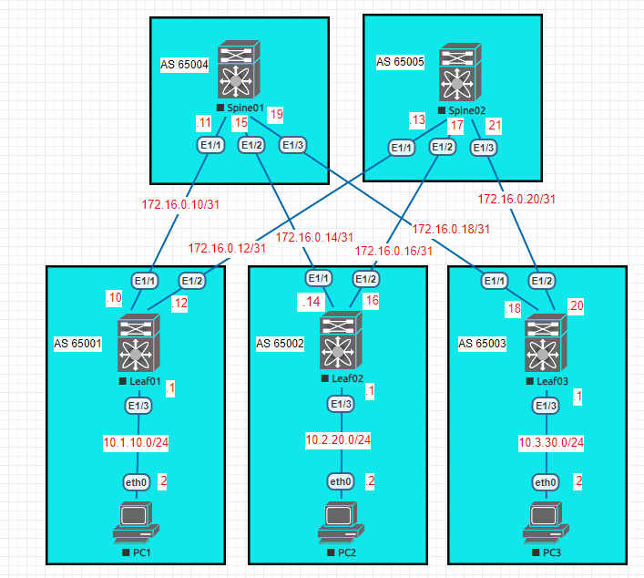

### BGP на базе Underlay N9k
### Цели
1. Распределить адресное пространство на Underlay сети.
2. Настроить IP связанность между всеми устройствами NXOS.
3. Настроить BGP для на устройствах NXOS.
3. Настроить аутентификацию на интерфесах между BGP соседями.
4. Проверить соседство и топологию между BGP соседями.
5. Проверить связность между PC1, PC2, PC3.
### Реализовать схему


### Таблица адресов
| Device        | Interface | IP Address   | Mask |
| ------------- |:----------| :------------| :----|
| Spine01       | Ethernet1 | 172.16.0.11  | /31  |
|               | Ethernet2 | 172.16.0.15  | /31  |
|               | Ethernet3 | 172.16.0.19  | /31  |
| Spine02       | Ethernet1 | 172.16.0.13  | /31  |
|               | Ethernet2 | 172.16.0.17  | /31  |
|               | Ethernet3 | 172.16.0.21  | /31  |
| Leaf01        | Ethernet1 | 172.16.0.10  | /31  |
|               | Ethernet2 | 172.16.0.12  | /31  |
|               | Ethernet3 | 10.1.10.1    | /24  |
| Leaf02        | Ethernet1 | 172.16.0.14  | /31  |
|               | Ethernet2 | 172.16.0.16  | /31  |
|               | Ethernet3 | 10.2.20.1    | /24  |
| Leaf03        | Ethernet1 | 172.16.0.18  | /31  |
|               | Ethernet2 | 172.16.0.20  | /31  |
|               | Ethernet3 | 10.3.30.1    | /24  |
| PC1           | Ethernet0 | 10.1.10.2    | /24  |
| PC2           | Ethernet0 | 10.2.20.2    | /24  |
| PC3           | Ethernet0 | 10.3.30.2    | /24  |
| PC4           | Ethernet0 | 10.3.30.3    | /24  |

### Конфигурация устройств
#### Spine01
```
feature bgp
interface Ethernet1/1
  description Leaf01 e1/1
  no switchport
  ip address 172.16.0.11/31
  no shutdown
interface Ethernet1/2
  description Leaf02 e1/1
  no switchport
  ip address 172.16.0.15/31
  no shutdown
interface Ethernet1/3
  description Leaf03 e1/1
  no switchport
  ip address 172.16.0.19/31
  no shutdown
interface loopback0
  ip address 10.10.10.4/32
router bgp 65004
  router-id 10.10.10.4
  bestpath as-path multipath-relax
  log-neighbor-changes
  address-family ipv4 unicast
    network 10.10.10.4/32
  template peer Leafs
    password 3 4258f34a25410d21
    address-family ipv4 unicast
      default-originate
  neighbor 172.16.0.10
    inherit peer Leafs
    remote-as 65001
    description Leaf01
    address-family ipv4 unicast
  neighbor 172.16.0.14
    inherit peer Leafs
    remote-as 65002
    description Leaf02
    address-family ipv4 unicast
  neighbor 172.16.0.18
    inherit peer Leafs
    remote-as 65003
    description Leaf03
    address-family ipv4 unicast
``` 
#### Spine02
```
feature bgp
interface Ethernet1/1
  description Leaf01 e1/2
  no switchport
  ip address 172.16.0.13/31
  no shutdown
interface Ethernet1/2
  description Leaf02 e1/2
  no switchport
  ip address 172.16.0.17/31
  no shutdown
interface Ethernet1/3
  description Leaf03 e1/2
  no switchport
  ip address 172.16.0.21/31
  no shutdown
 interface loopback0
  ip address 10.10.10.4/32 
router bgp 65005
  router-id 10.10.10.4
  bestpath as-path multipath-relax
  log-neighbor-changes
  address-family ipv4 unicast
    network 10.10.10.4/32
  template peer Leafs
    password 3 4258f34a25410d21
    address-family ipv4 unicast
      default-originate
  neighbor 172.16.0.12
    inherit peer Leafs
    remote-as 65001
    description Leaf01
    address-family ipv4 unicast
  neighbor 172.16.0.16
    inherit peer Leafs
    remote-as 65002
    description Leaf02
    address-family ipv4 unicast
  neighbor 172.16.0.20
    inherit peer Leafs
    remote-as 65003
    description Leaf03
    address-family ipv4 unicast
```
#### Leaf01
```
feature bgp
interface Ethernet1/1
  description Spine01 e1/1
  no switchport
  ip address 172.16.0.10/31
  no shutdown
interface Ethernet1/2
  description Spine02 e1/1
  no switchport
  ip address 172.16.0.12/31
  no shutdown
interface Ethernet1/3
  no switchport
  ip address 10.1.10.1/24
  no shutdown
interface loopback0
  ip address 10.10.10.1/32
router bgp 65001
  router-id 10.10.10.1
  bestpath as-path multipath-relax
  log-neighbor-changes
  address-family ipv4 unicast
    network 10.1.10.0/24
    network 10.10.10.1/32
  template peer Spines
    password 3 4258f34a25410d21
    address-family ipv4 unicast
  neighbor 172.16.0.11
    inherit peer Spines
    remote-as 65004
    description Spine01
  neighbor 172.16.0.13
    inherit peer Spines
    remote-as 65005
    description Spine02
```
#### Leaf02
```
feature bgp
interface Ethernet1/1
  description Spine01 e1/2
  no switchport
  ip address 172.16.0.14/31
  no shutdown
interface Ethernet1/2
  description Spine01 e1/2
  no switchport
  ip address 172.16.0.16/31
  no shutdown
interface Ethernet1/3
  no switchport
  ip address 10.2.20.1/24
  no shutdown
interface loopback0
  ip address 10.10.10.2/32
router bgp 65002
  router-id 10.10.10.2
  bestpath as-path multipath-relax
  log-neighbor-changes
  address-family ipv4 unicast
    network 10.2.20.0/24
    network 10.10.10.2/32
  template peer Spines
    password 3 4258f34a25410d21
    address-family ipv4 unicast
  neighbor 172.16.0.15
    inherit peer Spines
    remote-as 65004
    description Spine01
  neighbor 172.16.0.17
    inherit peer Spines
    remote-as 65005
    description Spine02
```
#### Leaf03
```
feature bgp
interface Ethernet1/1
  description Spine01 e1/3
  no switchport
  ip address 172.16.0.18/31
  no shutdown
interface Ethernet1/2
  description Spine02 e1/3
  no switchport
  ip address 172.16.0.20/31
  no shutdown
interface Ethernet1/3
  no switchport
  ip address 10.3.30.1/24
  no shutdown
interface loopback0
  ip address 10.10.10.3/32
router bgp 65003
  router-id 10.10.10.3
  bestpath as-path multipath-relax
  log-neighbor-changes
  address-family ipv4 unicast
    network 10.3.30.0/24
    network 10.10.10.3/32
  template peer Spines
    password 3 4258f34a25410d21
    address-family ipv4 unicast
  neighbor 172.16.0.19
    inherit peer Spines
    remote-as 65004
    description Spine01
  neighbor 172.16.0.21
    inherit peer Spines
    remote-as 65005
    description Spine02
``` 
#### PC1
```
IP/MASK: 10.1.10.2/24  
GATEWAY: 10.1.10.1
```  
#### PC2
```
IP/MASK: 10.2.20.2/24  
GATEWAY: 10.2.20.1
```  
#### PC3
```
IP/MASK: 10.3.30.2/24  
GATEWAY: 10.3.30.1  
```
#### PC4
```
IP/MASK: 10.3.30.3/24  
GATEWAY: 10.3.30.1 
``` 

### Вывод BGP соседства и топологии между устрйоствами
#### Spine01
```
Spine01# sh ip bgp summary
Neighbor        V    AS MsgRcvd MsgSent   TblVer  InQ OutQ Up/Down  State/PfxRcd
172.16.0.10     4 65001      11       9        2    0    0 00:05:58 0
172.16.0.14     4 65002      11      10        2    0    0 00:05:59 0
172.16.0.18     4 65003       9      11        2    0    0 00:05:22 0
```
```
Spine01# sh isis 1 database
IS-IS Process: 1 LSP database VRF: default
IS-IS Level-1 Link State Database
  LSPID                 Seq Number   Checksum  Lifetime   A/P/O/T
  Leaf01.00-00          0x00000013   0xBFC4    941        0/0/0/1
  Leaf02.00-00          0x00000013   0x57F1    976        0/0/0/1
  Leaf03.00-00          0x00000012   0xF01E    1038       0/0/0/1
  Spine01.00-00       * 0x00000014   0xA01E    811        0/0/0/1
  Spine02.00-00         0x0000000E   0xBEED    1020       0/0/0/1
```