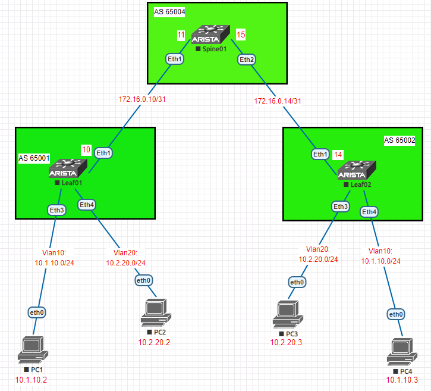

### VxLAN. EVPN L2 на базе Arista
### Цели
1. Распределить адресное пространство на Underlay сети.
2. Настроить IP связанность между всеми устройствами Arista.
3. Настроить BGP peering между Leaf и Spine в AF l2vpn evpn на устройствах Arista.
3. Настроить аутентификацию на интерфесах между BGP соседями.
4. Проверить соседство и топологию между BGP соседями через l2vpn.
5. Проверить связность между PC1, PC2.
### Реализовать схему


### Таблица адресов
| Device        | Interface | IP Address   | Mask |
| ------------- |:----------| :------------| :----|
| Spine01       | Ethernet1 | 172.16.0.11  | /31  |
|               | Ethernet2 | 172.16.0.15  | /31  |
| Leaf01        | Ethernet1 | 172.16.0.10  | /31  |
|               | Ethernet3 | vlan10       |      |
|               | Ethernet4 | vlan20       |      |
| Leaf02        | Ethernet1 | 172.16.0.14  | /31  |
|               | Ethernet3 | vlan20       |      |
|               | Ethernet4 | vlan10       |      |
| PC1           | Ethernet0 | 10.1.10.2    | /24  |
| PC2           | Ethernet0 | 10.2.20.2    | /24  |
| PC3           | Ethernet0 | 10.2.20.3    | /24  |
| PC4           | Ethernet0 | 10.1.10.3    | /24  |

### Конфигурация устройств
#### Spine01
```
ip routing
mpls ip
service routing protocols model multi-agent
interface Ethernet1
   no switchport
   ip address 172.16.0.11/31
interface Ethernet2
   no switchport
   ip address 172.16.0.15/31
interface Loopback0
   ip address 10.10.10.4/32
ip prefix-list Spine01_Local seq 5 permit 10.10.10.4/32
route-map FROM_Spine01 permit 10
   match ip address prefix-list Spine01_Local
peer-filter ASN_RANGE
   10 match as-range 65001-65003 result accept
router bgp 65004
   router-id 10.10.10.4
   bgp listen range 10.10.10.0/24 peer-group LEAF_OVERLAY peer-filter ASN_RANGE
   bgp listen range 172.16.0.0/27 peer-group Leafs peer-filter ASN_RANGE
   neighbor LEAF_OVERLAY peer group
   neighbor LEAF_OVERLAY update-source Loopback0
   neighbor LEAF_OVERLAY ebgp-multihop 2
   neighbor LEAF_OVERLAY send-community
   neighbor Leafs peer group
   neighbor Leafs bfd
   neighbor Leafs password 7 Bh07dM+j7UA=
   redistribute connected route-map FROM_Spine01
   address-family evpn
      neighbor LEAF_OVERLAY activate
   address-family ipv4
      no neighbor LEAF_OVERLAY activate
```
#### Leaf01
```
ip routing
mpls ip
service routing protocols model multi-agent
vlan 10,20
interface Ethernet1
   no switchport
   ip address 172.16.0.10/31
interface Ethernet3
   switchport access vlan 10
   spanning-tree portfast
interface Ethernet4
   switchport access vlan 20
   spanning-tree portfast
interface Loopback0
   ip address 10.10.10.1/32
interface Loopback1
   ip address 10.10.11.1/32
interface Vxlan1
   vxlan source-interface Loopback1
   vxlan udp-port 4789
   vxlan vlan 10 vni 10010
   vxlan vlan 20 vni 10020
ip prefix-list Leaf01_Local
   seq 5 permit 10.10.10.1/32
   seq 10 permit 10.10.11.1/32
route-map FROM_Leaf01 permit 10
   match ip address prefix-list Leaf01_Local
peer-filter ASN_RANGE
   10 match as-range 65004-65005 result accept
router bgp 65001
   router-id 10.10.10.1
   neighbor SPINE_OVERLAY peer group
   neighbor SPINE_OVERLAY remote-as 65004
   neighbor SPINE_OVERLAY update-source Loopback0
   neighbor SPINE_OVERLAY ebgp-multihop 2
   neighbor SPINE_OVERLAY send-community
   neighbor Spine_UNDERLAY peer group
   neighbor Spine_UNDERLAY remote-as 65004
   neighbor Spine_UNDERLAY bfd
   neighbor Spine_UNDERLAY description Spine01
   neighbor Spine_UNDERLAY password 7 Kaz+Y5hJvI8=
   neighbor 10.10.10.4 peer group SPINE_OVERLAY
   neighbor 172.16.0.11 peer group Spine_UNDERLAY
   redistribute connected route-map FROM_Leaf01
   vlan 10
      rd 10.10.10.1:10010
      route-target both 1:10010
      redistribute learned
   vlan 20
      rd 10.10.10.1:10020
      route-target both 1:10020
      redistribute learned
   address-family evpn
      neighbor SPINE_OVERLAY activate
   address-family ipv4
      no neighbor SPINE_OVERLAY activate
```
#### Leaf02
```
vlan 10,20
interface Ethernet1
   no switchport
   ip address 172.16.0.14/31
interface Ethernet3
   switchport access vlan 20
   spanning-tree portfast
interface Ethernet4
   switchport access vlan 10
   spanning-tree portfast
interface Loopback0
   ip address 10.10.10.2/32
interface Loopback1
   ip address 10.10.11.2/32
interface Vxlan1
   vxlan source-interface Loopback1
   vxlan udp-port 4789
   vxlan vlan 10 vni 10010
   vxlan vlan 20 vni 10020
ip prefix-list Leaf02_Local seq 5 permit 10.10.10.2/32
ip prefix-list Leaf02_Local seq 10 permit 10.10.11.2/32
route-map FROM_Leaf02 permit 10
   match ip address prefix-list Leaf02_Local
router bgp 65002
   router-id 10.10.10.2
   neighbor SPINE_OVERLAY peer group
   neighbor SPINE_OVERLAY remote-as 65004
   neighbor SPINE_OVERLAY update-source Loopback0
   neighbor SPINE_OVERLAY ebgp-multihop 2
   neighbor SPINE_OVERLAY send-community
   neighbor Spine_UNDERLAY peer group
   neighbor Spine_UNDERLAY remote-as 65004
   neighbor Spine_UNDERLAY bfd
   neighbor Spine_UNDERLAY description Spine01
   neighbor Spine_UNDERLAY password 7 Kaz+Y5hJvI8=
   neighbor 10.10.10.4 peer group SPINE_OVERLAY
   neighbor 172.16.0.15 peer group Spine_UNDERLAY
   redistribute connected route-map FROM_Leaf02
   vlan 10
      rd 10.10.10.2:10010
      route-target both 1:10010
      redistribute learned
   vlan 20
      rd 10.10.10.2:10020
      route-target both 1:10020
      redistribute learned
   address-family evpn
      neighbor SPINE_OVERLAY activate
   address-family ipv4
      no neighbor SPINE_OVERLAY activate
```
#### PC1
```
IP/MASK: 10.1.10.2/24  
GATEWAY: 10.1.10.1
```  
#### PC2
```
IP/MASK: 10.2.20.2/24  
GATEWAY: 10.2.20.1
```  
#### PC3
```
IP/MASK: 10.2.20.3/24  
GATEWAY: 10.2.20.1  
```
#### PC4
```
IP/MASK: 10.1.10.3/24  
GATEWAY: 10.1.10.1 
``` 
### Вывод BGP, evpn соседства и топологии между устрйоствами
#### Spine01
```
Spine01#sh ip bgp summary
  Neighbor    V AS           MsgRcvd   MsgSent  InQ OutQ  Up/Down State   PfxRcd PfxAcc
  172.16.0.10 4 65001             60        58    0    0 00:46:09 Estab   2      2
  172.16.0.14 4 65002             59        59    0    0 00:46:31 Estab   2      2
```
```
Spine01#sh bgp evpn summary
  Neighbor   V AS           MsgRcvd   MsgSent  InQ OutQ  Up/Down State   PfxRcd PfxAcc
  10.10.10.1 4 65001             70        65    0    0 00:46:42 Estab   2      2
  10.10.10.2 4 65002             68        68    0    0 00:47:05 Estab   2      2
```
```
Spine01#sh bgp evpn
          Network                Next Hop              Metric  LocPref Weight  Path
 * >     RD: 10.10.10.1:10010 imet 10.10.11.1
                                 10.10.11.1            -       100     0       65001 i
 * >     RD: 10.10.10.1:10020 imet 10.10.11.1
                                 10.10.11.1            -       100     0       65001 i
 * >     RD: 10.10.10.2:10010 imet 10.10.11.2
                                 10.10.11.2            -       100     0       65002 i
 * >     RD: 10.10.10.2:10020 imet 10.10.11.2
                                 10.10.11.2            -       100     0       65002 i
```
#### Leaf01
```
Leaf01#sh ip bgp summary
  Description              Neighbor    V AS           MsgRcvd   MsgSent  InQ OutQ  Up/Down State   PfxRcd PfxAcc
  Spine01                  172.16.0.11 4 65004             65        67    0    0 00:52:19 Estab   3      3
```
```
Leaf01#sh bgp evpn summary
  Description              Neighbor   V AS           MsgRcvd   MsgSent  InQ OutQ  Up/Down State   PfxRcd PfxAcc
                           10.10.10.4 4 65004             73        78    0    0 00:52:58 Estab   3      3
```
```
Leaf01#sh bgp evpn
          Network                Next Hop              Metric  LocPref Weight  Path
 * >     RD: 10.10.10.2:10010 mac-ip 0050.7966.6805
                                 10.10.11.2            -       100     0       65004 65002 i
 * >     RD: 10.10.10.1:10010 mac-ip 0050.7966.6806
                                 -                     -       -       0       i
 * >     RD: 10.10.10.2:10010 imet 10.10.11.2
                                 10.10.11.2            -       100     0       65004 65002 i
 * >     RD: 10.10.10.2:10020 imet 10.10.11.2
                                 10.10.11.2            -       100     0       65004 65002 i
 * >     RD: 10.10.10.1:10010 imet 10.10.11.1
                                 -                     -       -       0       i
 * >     RD: 10.10.10.1:10020 imet 10.10.11.1
                                 -                     -       -       0       i
```
#### Leaf02
```
Leaf02#sh ip bgp summary
  Description              Neighbor    V AS           MsgRcvd   MsgSent  InQ OutQ  Up/Down State   PfxRcd PfxAcc
  Spine01                  172.16.0.15 4 65004             69        69    0    0 00:54:56 Estab   3      3
```
```
Leaf02#sh bgp evpn summary
  Description              Neighbor   V AS           MsgRcvd   MsgSent  InQ OutQ  Up/Down State   PfxRcd PfxAcc
                           10.10.10.4 4 65004             78        78    0    0 00:55:15 Estab   3      3
```
```
Leaf02#sh bgp evpn
          Network                Next Hop              Metric  LocPref Weight  Path
 * >     RD: 10.10.10.2:10010 mac-ip 0050.7966.6805
                                 -                     -       -       0       i
 * >     RD: 10.10.10.1:10010 mac-ip 0050.7966.6806
                                 10.10.11.1            -       100     0       65004 65001 i
 * >     RD: 10.10.10.1:10010 imet 10.10.11.1
                                 10.10.11.1            -       100     0       65004 65001 i
 * >     RD: 10.10.10.1:10020 imet 10.10.11.1
                                 10.10.11.1            -       100     0       65004 65001 i
 * >     RD: 10.10.10.2:10010 imet 10.10.11.2
                                 -                     -       -       0       i
 * >     RD: 10.10.10.2:10020 imet 10.10.11.2
                                 -                     -       -       0       i
```                                 