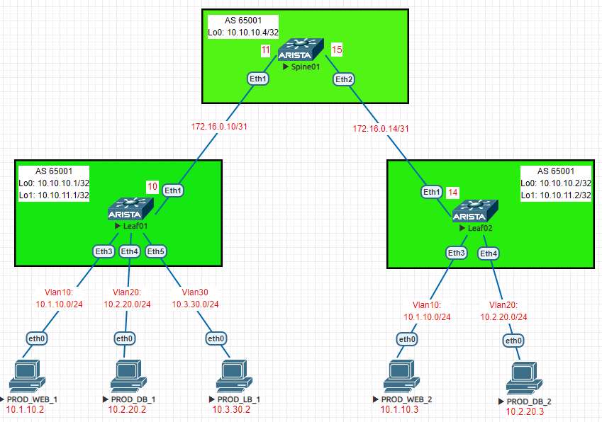

### VxLAN. EVPN L3 на базе Arista
### Цели
1. Распределить адресное пространство на Underlay сети.
2. Настроить IP связанность между всеми устройствами Arista.
3. Настроить BGP peering между Leaf и Spine в AF l3vpn evpn на устройствах Arista (Vlan-Based).
4. Проверить соседство и топологию между BGP соседями через l3vpn.
5. Проверить связность между PC1, PC2.
6. В качестве дополнения выполнить настройку l2vpn evpn на примере vlan-aware-bundle.
### Реализовать схему

### Таблица адресов
| Device        | Interface | IP Address   | Mask |
| ------------- |:----------| :------------| :----|
| Spine01       | Ethernet1 | 172.16.0.11  | /31  |
|               | Ethernet2 | 172.16.0.15  | /31  |
| Leaf01        | Ethernet1 | 172.16.0.10  | /31  |
|               | Ethernet3 | vlan10       |      |
|               | Ethernet4 | vlan20       |      |
|               | Ethernet5 | vlan30       |      |
|               | Loopback0 | 10.10.10.1   | /32  |
|               | Loopback1 | 10.10.11.1   | /32  |
| Leaf02        | Ethernet1 | 172.16.0.14  | /31  |
|               | Ethernet3 | vlan10       |      |
|               | Ethernet4 | vlan20       |      |
|               | Loopback0 | 10.10.10.2   | /32  |
|               | Loopback1 | 10.10.11.2   | /32  |
| PC1 PROD_WEB_1| Ethernet0 | 10.1.10.2    | /24  |
| PC2 PROD_DB_1 | Ethernet0 | 10.2.20.2    | /24  |
| PC3 PROD_LB_1 | Ethernet0 | 10.3.30.2    | /24  |
| PC4 PROD_WEB_2| Ethernet0 | 10.1.10.3    | /24  |
| PC5 PROD_DB_2 | Ethernet0 | 10.2.20.3    | /24  |

### Конфигурация устройств
#### Spine01